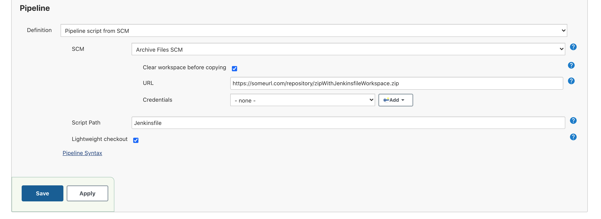

ArchiveFilesSCM plugin for Jenkins checkouts using remote archive files and extracts to a Jenkins job workspace

### This Plugin has been resurrected from the grave to work with pipelines and Jenkins in 2021!


# Main Changes:
 - Removed deprecated methods and added new ones in favor of what Jenkins requires in 2021
 - Utilizes the credentials plugin for authentication
 - Works with pipeline jobs for selecting source code for starting one
 - SCM Step created to allow checkouts within pipeline code
 - When extracting a compressed file, the top folder is removed, exposing all files below. This is similar to the git plugin checkout command 


# ArchiveFilesSCM Pipeline Setup


# SCM Pipeline Step Example

```
stage('Checking out different repo') {
    steps {
        dir('subdir') {
            checkout([$class: 'ArchiveFilesSCM', url: 'https://someurl.com/repo.zip', clearWorkspace: true, credentialsId: 'cred_id'])
        }
    }
}
```

# Build and Test
```
# This will take awhile
mvn clean install

mvn hpi:run
```

Then just go to <http://localhost:8080/jenkins> to test the plugin

# Example of

Plugin

- checkouts archive file only when last modified date(last-modified header returned when connecting to a URL) changes from last checkout date

- supports pooling using the same above logic

- supports extraction of zip,tar,gz,jar,war,ear files

- detects type of archive file based on file name (i.e URL must end with zip,tar,tar.gz,jar,war,ear)

- supports basic authentication

- supports connection through proxy

- supports running on slave

- supports http:// and file:// protocols e.g - URL can be
http://www.apache.org/dyn/closer.cgi/maven/binaries/apache-maven-3.0.4-bin.tar.gz

Note: If the type is unknown the plugin will simply copy the file to workspace
