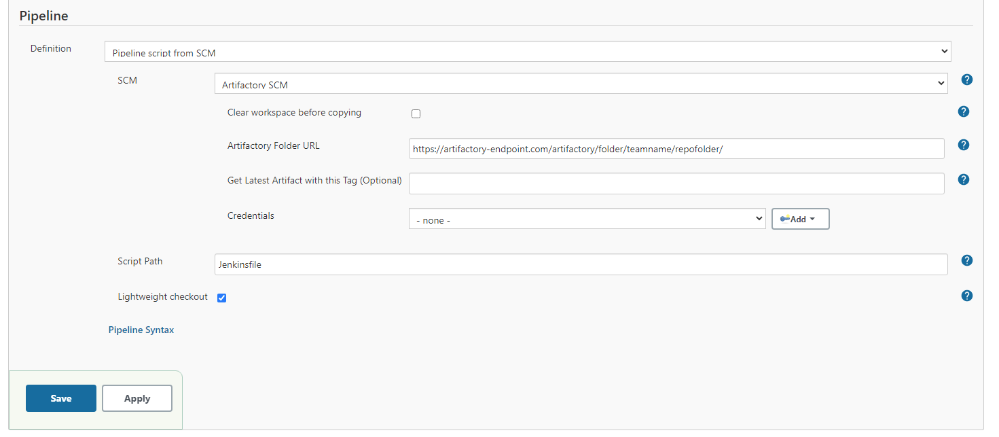

ArtifactorySCM plugin for Jenkins checkouts using remote artifactory endpoints and it's API to extract pipeline source code to a Jenkins job workspace

This was built off the ArchiveFilesSCM plugin which allows for sourcing pipeline code from any remote URL.

# Main Changes - v1.01:
 - The URL is now just the repository folder URL you can copy from Artifactory directly
 - Not specifying the latestVersionTag will grab the latest version artifactory has for the repository
 - Specifying the latestVersionTag will pick an artifact if it's prefixed with that tag. 
   - ex: "main" will pick the latest artifact labeled "main-version.zip"
 - Leaving clearWorkspace off (Now Recommended!) now properly overwrites old files when a new version is available, so using the cache is now a safe option 

# v1.00
 - Removed deprecated methods and added new ones in favor of what Jenkins requires in 2021
 - Utilizes the credentials plugin for authentication
 - Works with pipeline jobs for selecting source code for starting one
 - SCM Step created to allow checkouts within pipeline code
 - When extracting a compressed file, the top folder is removed, exposing all files below. This is similar to the git plugin checkout command 


# ArtifactorySCM Pipeline Setup


# SCM Pipeline Step Example
```
stage('Checking out different repo') {
    steps {
        dir('subdir') {
            checkout([$class: 'ArtifactorySCM', url: 'https://artifactory-endpoint.com/repofolder', latestVersionTag: "", clearWorkspace: true, credentialsId: 'cred_id'])
        }
    }
}
```

# Build and Test
```
# This will take awhile
mvn clean install

mvn hpi:run
```

Then just go to <http://localhost:8080/jenkins> to test the plugin

# Old features

Plugin

- checkouts archive file only when last modified date(last-modified header returned when connecting to a URL) changes from last checkout date

- supports pooling using the same above logic

- supports extraction of zip,tar,gz,jar,war,ear files

- detects type of archive file based on file name (i.e URL must end with zip,tar,tar.gz,jar,war,ear)

- supports basic authentication

- supports http:// and file:// protocols e.g - URL can be
http://www.apache.org/dyn/closer.cgi/maven/binaries/apache-maven-3.0.4-bin.tar.gz

Note: If the type is unknown the plugin will simply copy the file to workspace

TODO: 
- supports running on slave
